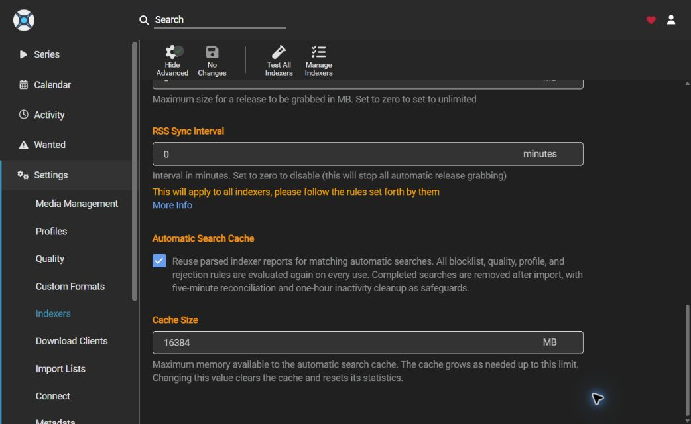
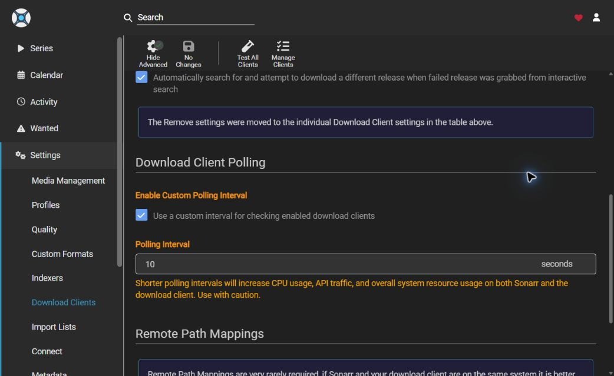
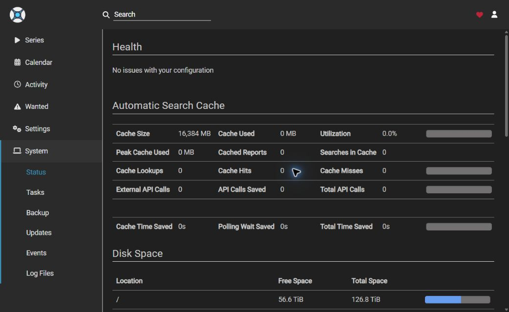

# Sonarr Automatic Search Performance Results

---

## What this branch does:

This branch is intended to make large automatic searches and failed-download recovery more efficient. It reduces repeated indexer work, gives sonarr more opportunities to recover a failed download, and reduces the amount of time sab sits idle waiting for sonarr to react.

Full Turbo is the name used in this report when all of the following changes are enabled together:

- Implements the [#8884 retry behavior](https://github.com/Sonarr/Sonarr/pull/8884) so sonarr can try the same release from another indexer after the first copy fails
- Reduces download client polling from the stock 60 seconds to 10 seconds so completed and failed downloads are handled sooner
- Enables an automatic search cache with a 16GB limit[^1] so retry searches can reuse reports instead of calling the indexers again
- Removes obsolete cache entries after a successful import, with a one-hour expiry as a fallback[^2]
- Adds settings to change the polling rate and cache size
- Added a section in System | Status which shows how the cache is performing, API calls saved, cache misses and estimated time saved

Stock means:

- Normal sonarr behavior without [#8884](https://github.com/Sonarr/Sonarr/pull/8884)
- Automatic search cache is disabled
- Download client polling left at 60 seconds

## The result that matters:

My 2GB internet connection became the final bottleneck during the largest tests. That means the total time required to transfer several terabytes cannot by itself show how much more efficiently sonarr performed. Once sab has enough work to saturate the connection, neither faster polling nor cached searches can make the connection transfer data faster. The correct comparison is how much useful work sonarr completes for each unit of time, bandwidth, and external API allowance.

## 4,000 episode result:

The final result compares stock sonarr with Full Turbo across a balanced 4,000-episode workload containing both first-attempt successes and episodes requiring failed-download recovery. Full Turbo completed the workload in effectively the same time while processing more sab attempts, recovering additional episodes, saving 76% of the external API calls, and cutting sab idle time by 65%. It delivered 300% more successful episodes for every 1,000 external API calls without increasing the time required for each successful episode.

## What each feature proves:

### &nbsp;&nbsp;&nbsp;Automatic search cache

- Saved 25,296 external API calls, reducing external API traffic by 76%
- Produces 300% more successful results per 1,000 external API calls
- Avoids repeated indexer response and report-processing work, even when an already-saturated download queue hides that saving from final completion time

### &nbsp;&nbsp;&nbsp;Faster download client polling

- Reduced sab idle time by 49%
- Increased download attempt and successful download throughput by 15%
- Reduced the time required per successful download by 13%
- Increased the effective end to end data rate by 15%
- Reduced median sab idle time by 65%
- the final time benefit becomes naturally hidden once sab already has hundreds or thousands of pending jobs

### &nbsp;&nbsp;&nbsp;[#8884](https://github.com/Sonarr/Sonarr/pull/8884) retry behavior

- Performs additional valid attempts that stock behavior would abandon
- Recovers additional episodes rather than merely ending the run sooner
- Processed 293 additional sab attempts, a 3% increase
- It should be judged primarily by recovery yield and useful output, not as a raw speed feature

### &nbsp;&nbsp;&nbsp;Full Turbo combined result

- Increased download attempt throughput by 48%
- Increased successful download throughput by 12%
- Reduced the time required per successful download by 10%
- Increased the effective end to end data rate by 21%
- Increased sab utilization by 27%

## Bottom line

The 4,000-episode result does not show a dramatic reduction in the time required to transfer several terabytes because the internet connection is the final bottleneck. It does show that sonarr can feed sab more consistently, process more attempts per hour, recover additional failed downloads, and use external API allowances far more efficiently. This means sonarr is no longer the bottleneck in your workflow, your internet connection will be.

## Screenshots

### Automatic search cache settings

### Custom download client polling

### Cache status

## Supporting evidence

The supporting data, trace extracts, checksums and notes are available in the [evidence folder](evidence/README.md).

[^1]: The 16GB setting is a maximum limit, not a permanent memory allocation. The cache starts at 0MB and grows dynamically as sonarr stores processed indexer reports from automatic searches. When a failed download causes sonarr to search again, it will reuse the cached reports instead of repeating the external indexer calls.

[^2]: The current cache size decreases as completed and imported work is removed. Any remaining entry expires after one hour, so an inactive cache returns to 0MB after the timeout. If the cache reaches its configured limit before that timeout, older entries are removed to keep memory use within that limit. This allows a large search to use the memory it needs without permanently holding the full 16GB or whatever setting you choose to use.
